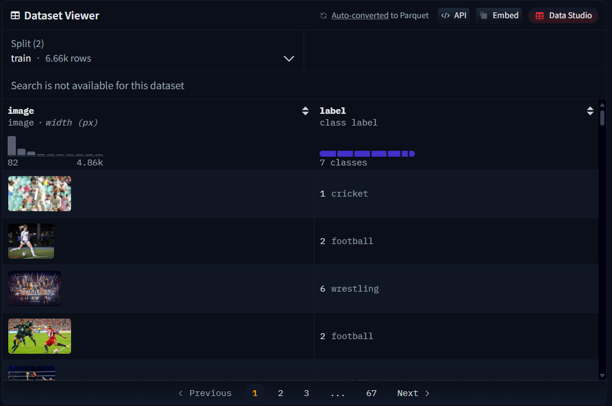
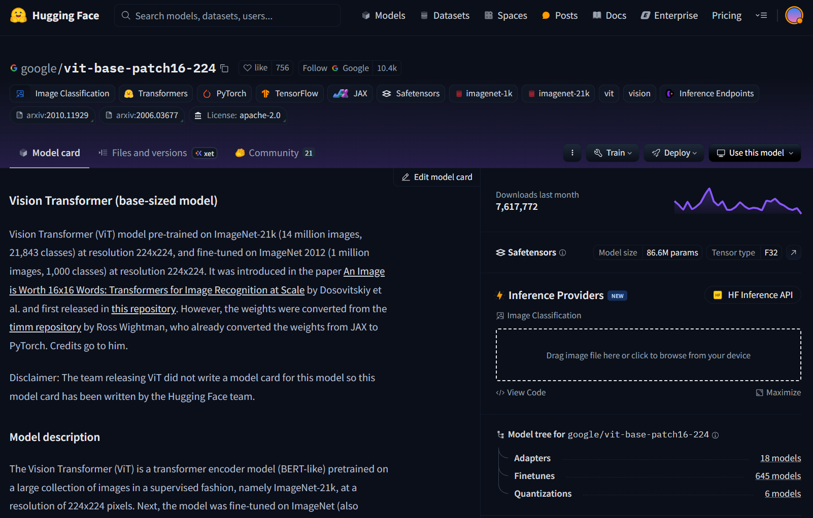
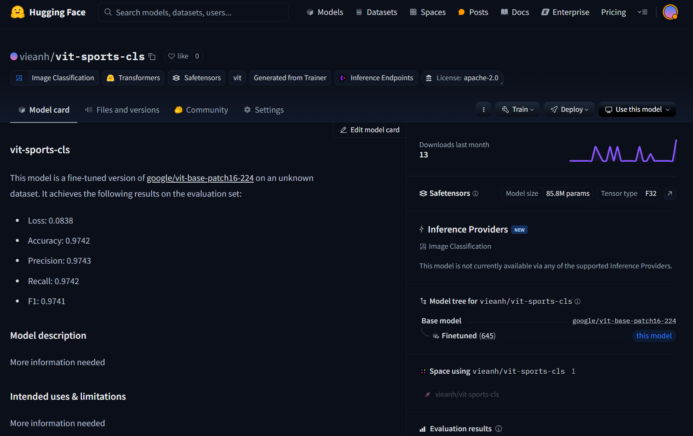
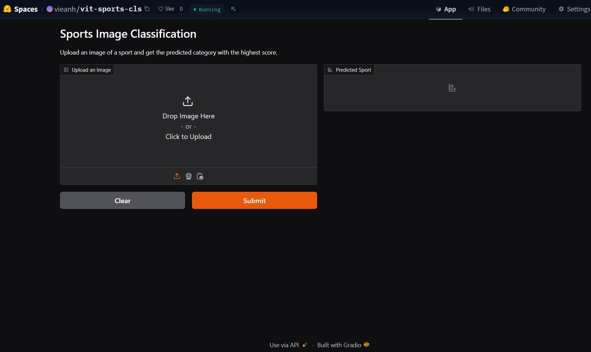

# Dự án cá nhân: Sports_Image_Classification

## Giới thiệu mô hình
Dự án cá nhân: Xây dựng mô hình phân loại ảnh các môn thể thao

Kiến trúc: Vision Transformer (ViT) trong bài báo [An Image is Worth 16x16 Words: Transformers for Image Recognition at Scale](https://arxiv.org/abs/2010.11929)

## Dữ liệu
Ảnh được thu thập từ 2 nguồn dữ liệu dataset trên Kaggle, sau đó tổng hợp tạo thành 1 bộ dữ liệu gồm 8319 ảnh với 7 nhãn dán tương ứng (badminton, cricket, football, karate, swimming, tennis, wrestling)
- Nhãn badminton: 1394 ảnh
- Nhãn cricket: 1556 ảnh
- Nhãn karate: 613 ảnh
- Nhãn football: 1188 ảnh
- Nhãn swimming: 652 ảnh
- Nhãn tennis: 1445 ảnh
- Nhãn wrestling: 1471 ảnh

## Tiền xử lý dữ liệu
Ảnh sau khi thu thập được lọc để loại bỏ những ảnh nhiễu và có độ tương đồng cao sử dụng thư viện [fastdup](https://github.com/visual-layer/fastdup)

Sau khi tiền xử lý, còn 8258 ảnh, trong đó:
- Nhãn badminton: 1394 ảnh
- Nhãn cricket: 1506 ảnh
- Nhãn karate: 613 ảnh
- Nhãn football: 1188 ảnh
- Nhãn swimming: 652 ảnh
- Nhãn tennis: 1443 ảnh
- Nhãn wrestling: 1462 ảnh

Dữ liệu được upload trên Huggingface Hub [tại đây](https://huggingface.co/datasets/vieanh/sports_img_classification)

## Huấn luyện
Khởi tạo: Finetune mô hình [ViT](https://huggingface.co/google/vit-base-patch16-224) đã được pretrain trên tập dữ liệu ImageNet của Google trên Huggingface Hub.

Dữ liệu được chia thành 2 tập train và test theo tỉ lệ 80-20.

Tham số huấn luyện:
- learning_rate: 5e-05
- train_batch_size: 64
- eval_batch_size: 64
- seed: 42
- optimizer: Use adamw_torch with betas=(0.9,0.999) and epsilon=1e-08 and optimizer_args=No additional optimizer arguments
- lr_scheduler_type: linear
- lr_scheduler_warmup_ratio: 0.1
- num_epochs: 10

## Kết quả

Kết quả huấn luyện:
| Training Loss| Epoch | Validation Loss| Accuracy | F1       | Recall   | Precision |
|--------------|-------|----------------|----------|----------|----------|-----------|
| 0.171000     | 1.0   | 0.172852       | 0.948918 | 0.948893 | 0.948918 | 0.949258  |
| 0.097900     | 2.0   | 0.135628       | 0.958534 | 0.958253 | 0.958534 | 0.959698  |
| 0.040800     | 3.0   | 0.118449       | 0.956130 | 0.956082 | 0.956130 | 0.957052  |
| 0.070300     | 4.0   | 0.089200       | 0.969952 | 0.969907 | 0.969952 | 0.970078  |
| 0.137500     | 5.0   | 0.102929       | 0.968149 | 0.968168 | 0.968149 | 0.968347  |
| 0.006100     | 6.0   | 0.107263       | 0.968149 | 0.968194 | 0.968149 | 0.968801  |
| 0.008300     | 7.0   | 0.079484       | 0.969952 | 0.970010 | 0.969952 | 0.970131  |
| 0.007900     | 8.0   | 0.075374       | 0.981370 | 0.981391 | 0.981370 | 0.981616  |
| 0.059400     | 9.0   | 0.071397       | 0.975361 | 0.975405 | 0.975361 | 0.975616  |
| 0.039100     | 10.0  | 0.083812       | 0.974159 | 0.974147 | 0.974159 | 0.974285  |

Kết quả tốt nhất trên tập test:
- Loss: 0.0061
- Accuracy: 0.9814
- F1: 0.9814
- Recall: 0.9814
- Precision: 0.9816

Model được upload lên Huggingface Hub [tại đây](https://huggingface.co/vieanh/vit-sports-cls)

Link Demo [tại đây](https://huggingface.co/vieanh/vit-sports-cls)

## Thư viện sử dụng
- Transformers, Pytorch, Tokenizers: load mô hình và huấn luyện
- Datasets: load dữ liệu
- Evaluate: đánh giá mô hình
- Wandb: theo dõi quá trình huấn luyện